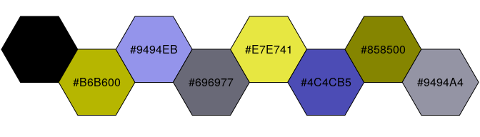
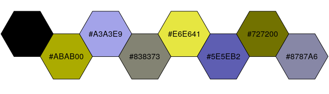
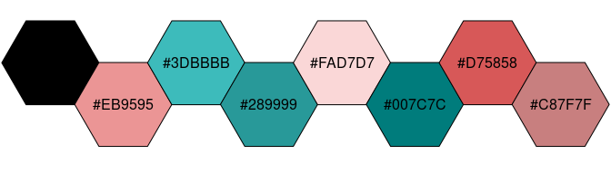
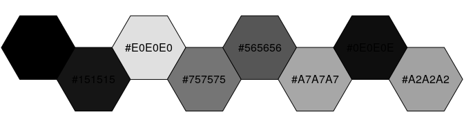

<!-- README.md is generated from README.Rmd. Please edit that file -->

# khroma 

<!-- badges: start -->

[](https://github.com/tesselle/khroma/actions)
[](https://codecov.io/gh/tesselle/khroma)

[](https://cran.r-project.org/package=khroma)
[](https://cran.r-project.org/web/checks/check_results_khroma.html)
[](https://cran.r-project.org/package=khroma)

[](https://www.repostatus.org/#active)
[](https://www.tidyverse.org/lifecycle/#stable)

[](https://doi.org/10.5281/zenodo.1472077)
<!-- badges: end -->

## Overview

Color blindness affects a large number of individuals. When
communicating scientific results colour palettes must therefore be
carefully chosen to be accessible to all readers.

This R package provides an implementation of Paul Tol[1] and Okabe and
Ito[2] colour schemes. These schemes are ready for each type of data
(qualitative, diverging or sequential), with colours that are distinct
for all people, including colour-blind readers. This package also
provides tools to simulate colour-blindness and to test how well the
colours of any palette are identifiable. To simulate colour-blindness in
production-ready R figures you may also be interested in the
[**colorblindr**](https://github.com/clauswilke/colorblindr) package.

For specific uses, several scientific thematic schemes (geologic
timescale, land cover, FAO soils, etc.) are implemented, but these
colour schemes may not be colour-blind safe.

All these colour schemes are implemented for use with base R or
[**ggplot2**](https://github.com/tidyverse/ggplot2).

## Installation

You can install the released version of **khroma** from
[CRAN](https://CRAN.R-project.org):

``` r
install.packages("khroma")
```

And the development version from [GitHub](https://github.com/) with:

``` r
# install.packages("remotes")
remotes::install_github("nfrerebeau/khroma")
```

## Usage

``` r
# Load packages
library(khroma)
library(ggplot2)
```

### Colour palettes and scales

`colour()` returns a palette function that when called with a single
integer argument returns a vector of colours.

``` r
# Paul Tol's bright colour scheme
bright <- colour("bright")
```

If [**crayon**](https://github.com/r-lib/crayon) is installed on your
machine and if the `crayon.enabled` option is set to `TRUE` with
`options()`, colours will be nicely printed in the console.


You can disable this feature by setting the `crayon.enabled` option to
`FALSE`.

``` r
options(crayon.enabled = FALSE)
bright(7)
#>      blue       red     green    yellow      cyan    purple      grey 
#> "#4477AA" "#EE6677" "#228833" "#CCBB44" "#66CCEE" "#AA3377" "#BBBBBB" 
#> attr(,"missing")
#> [1] NA
```

``` r
# Show the colour palette
plot_scheme(bright(7), colours = TRUE)
```


``` r
# Use with ggplot2
ggplot(data = mpg, mapping = aes(x = displ, y = hwy, colour = class)) +
  geom_point() +
  scale_colour_bright()
```


### Diagnostic tools

#### Test how well the colours are identifiable

``` r
# Okabe & Ito's colour scheme
okabe <- colour("okabe ito")

set.seed(12345)
plot_map(okabe(8))
```


#### Compute CIELAB distance metric

``` r
DeltaE <- compare(okabe(8))
round(DeltaE, 2)
#>                black orange sky blue bluish green yellow  blue vermilion
#> orange         64.74                                                    
#> sky blue       60.95  53.61                                             
#> bluish green   50.51  42.87    34.69                                    
#> yellow         88.42  21.72    57.53        38.04                       
#> blue           39.23  55.35    22.31        38.40  70.37                
#> vermilion      49.36  22.24    52.27        54.36  43.71 49.62          
#> reddish purple 53.11  49.01    45.51        63.45  62.54 41.11     37.02
```

#### Simulate colour-blindness

``` r
# convert() returns a modified palette function
deuteranopia <- convert(okabe, mode = "deuteranopia")
plot_scheme(deuteranopia(8), colours = TRUE)
```



``` r
protanopia <- convert(okabe, mode = "protanopia")
plot_scheme(protanopia(8), colours = TRUE)
```



``` r
tritanopia <- convert(okabe, mode = "tritanopia")
plot_scheme(tritanopia(8), colours = TRUE)
```



``` r
achromatopsia <- convert(okabe, mode = "achromatopsia")
plot_scheme(achromatopsia(8), colours = TRUE)
```



``` r
plot_scheme_colourblind(okabe(8))
```


``` r
# ggplot2 default colour scheme
# (equally spaced hues around the colour wheel)
x <- scales::hue_pal()(8)
plot_scheme_colourblind(x)
```


## Colour Schemes

### Paul Tol’s Colour Schemes

Paul Tol offers carefully chosen schemes, ready for each type of data,
with colours that are:

-   Distinct for all people, including colour-blind readers.
-   Distinct from black and white.
-   Distinct on screen and paper.
-   Matching well together.

All the scales presented in Paul Tol’s technical note are implemented
here, for use with base R or
[**ggplot2**](https://github.com/tidyverse/ggplot2). Refer to the
original document for details about the recommended uses.

See `vignette("tol")` for a more complete overview.

### Scientific colour schemes

The following scientific colour schemes are available:

-   International Chronostratigraphic Chart;
-   AVHRR Global Land Cover Classification;
-   FAO Soil Reference Groups.

More will be added in future releases ([suggestions are
welcome](https://github.com/tesselle/khroma/issues)).

## Contributing

Please note that the **khroma** project is released with a [Contributor
Code of
Conduct](https://github.com/tesselle/khroma/blob/master/.github/CODE_OF_CONDUCT.md).
By contributing to this project, you agree to abide by its terms.

[1] Tol, P. (2018). *Colour Schemes*. SRON. Technical Note
No. SRON/EPS/TN/09-002. URL:
<https://personal.sron.nl/~pault/data/colourschemes.pdf>.

[2] Okabe, M. & Ito, K. (2008). *Color Universal Design (CUD): How to
Make Figures and Presentations That Are Friendly to Colorblind People*.
URL: <https://jfly.uni-koeln.de/color/>.
