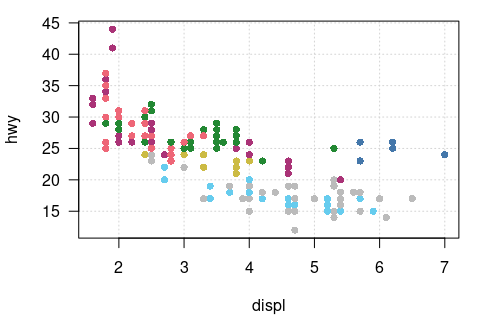
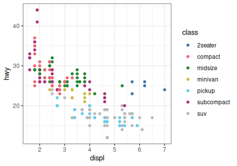
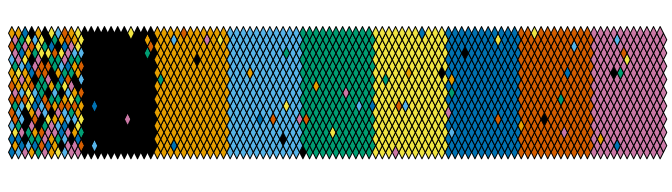
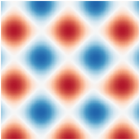
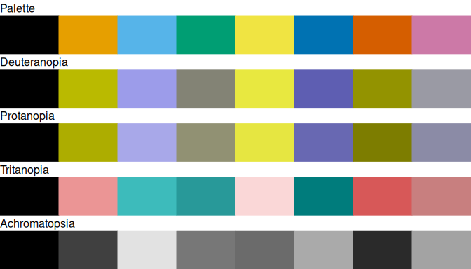
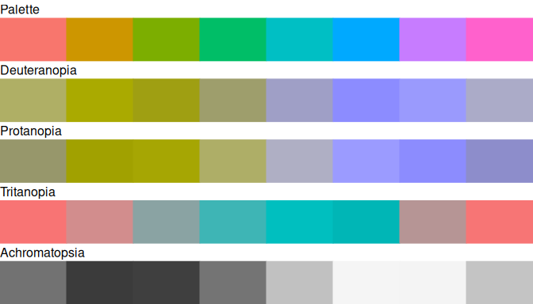

<!-- README.md is generated from README.Rmd. Please edit that file -->

# khroma 

<!-- badges: start -->

[](https://github.com/tesselle/khroma/actions)
[](https://app.codecov.io/gh/tesselle/khroma)
[](https://www.codefactor.io/repository/github/tesselle/khroma/overview/main)
[](https://cran.r-project.org/package=khroma)

<a href="https://tesselle.r-universe.dev/khroma"
class="pkgdown-devel"></a>
<a href="https://cran.r-project.org/package=khroma"
class="pkgdown-release"></a> <a
href="https://cran.r-project.org/web/checks/check_results_khroma.html"
class="pkgdown-release"></a>
<a href="https://cran.r-project.org/package=khroma"
class="pkgdown-release"></a>

[](https://www.repostatus.org/#active)

[](https://doi.org/10.5281/zenodo.1472077)
<!-- badges: end -->

## Overview

Color blindness affects a large number of individuals. When
communicating scientific results color palettes must therefore be
carefully chosen to be accessible to all readers.

This R package provides an implementation of Okabe and Ito (2008), Tol
(2021) and Crameri (2018) color schemes. These schemes are ready for
each type of data (qualitative, diverging or sequential), with colors
that are distinct for all people, including color-blind readers. This
package also provides tools to simulate color-blindness and to test how
well the colors of any palette are identifiable. To simulate
color-blindness in production-ready R figures you may also be interested
in the [**colorblindr**](https://github.com/clauswilke/colorblindr)
package.

Tol (2021) and Crameri (2018) offer carefully chosen schemes, ready for
each type of data, with colors that are:

- Distinct for all people, including color-blind readers,
- Distinct from black and white,
- Distinct on screen and paper,
- Matching well together,
- Citable and reproducible.

See `vignette("tol")` and `vignette("crameri")` for a more complete
overview.

For specific uses, several scientific thematic schemes (geologic
timescale, land cover, FAO soils, etc.) are implemented, but these color
schemes may not be color-blind safe.

All these color schemes are implemented for use with base R **graphics**
or [**ggplot2**](https://github.com/tidyverse/ggplot2) and
[**ggraph**](https://github.com/thomasp85/ggraph).

------------------------------------------------------------------------

To cite khroma in publications use:

Frerebeau N (2024). *khroma: Colour Schemes for Scientific Data
Visualization*. Université Bordeaux Montaigne, Pessac, France.
<doi:10.5281/zenodo.1472077> <https://doi.org/10.5281/zenodo.1472077>, R
package version 1.14.0, <https://packages.tesselle.org/khroma/>.

This package is a part of the tesselle project
<https://www.tesselle.org>.

## Installation

You can install the released version of **khroma** from
[CRAN](https://CRAN.R-project.org):

``` r
install.packages("khroma")
```

And the development version from [GitHub](https://github.com/) with:

``` r
# install.packages("remotes")
remotes::install_github("tesselle/khroma")
```

## Usage

``` r
## Install extra packages (if needed)
# install.packages("ggplot2"))

## Load packages
library(khroma)
```

<details>
<summary>
<strong>Available palettes</strong> (click to expand)
</summary>

``` r
## Get a table of available palettes
info()
#>            palette        type max missing
#> 1             broc   diverging 256    <NA>
#> 2             cork   diverging 256    <NA>
#> 3              vik   diverging 256    <NA>
#> 4           lisbon   diverging 256    <NA>
#> 5           tofino   diverging 256    <NA>
#> 6           berlin   diverging 256    <NA>
#> 7             roma   diverging 256    <NA>
#> 8              bam   diverging 256    <NA>
#> 9           vanimo   diverging 256    <NA>
#> 10          oleron   diverging 256    <NA>
#> 11          bukavu   diverging 256    <NA>
#> 12             fes   diverging 256    <NA>
#> 13           devon  sequential 256    <NA>
#> 14         lajolla  sequential 256    <NA>
#> 15          bamako  sequential 256    <NA>
#> 16           davos  sequential 256    <NA>
#> 17          bilbao  sequential 256    <NA>
#> 18            nuuk  sequential 256    <NA>
#> 19            oslo  sequential 256    <NA>
#> 20           grayC  sequential 256    <NA>
#> 21          hawaii  sequential 256    <NA>
#> 22           lapaz  sequential 256    <NA>
#> 23           tokyo  sequential 256    <NA>
#> 24            buda  sequential 256    <NA>
#> 25           acton  sequential 256    <NA>
#> 26           turku  sequential 256    <NA>
#> 27           imola  sequential 256    <NA>
#> 28          batlow  sequential 256    <NA>
#> 29         batlowW  sequential 256    <NA>
#> 30         batlowK  sequential 256    <NA>
#> 31           brocO  sequential 256    <NA>
#> 32           corkO  sequential 256    <NA>
#> 33            vikO  sequential 256    <NA>
#> 34           romaO  sequential 256    <NA>
#> 35            bamO  sequential 256    <NA>
#> 36          bright qualitative   7    <NA>
#> 37    highcontrast qualitative   3    <NA>
#> 38         vibrant qualitative   7    <NA>
#> 39           muted qualitative   9 #DDDDDD
#> 40  mediumcontrast qualitative   6    <NA>
#> 41            pale qualitative   6    <NA>
#> 42            dark qualitative   6    <NA>
#> 43           light qualitative   9    <NA>
#> 44 discreterainbow qualitative  23 #777777
#> 45          sunset   diverging  11 #FFFFFF
#> 46       nightfall   diverging  17 #FFFFFF
#> 47            BuRd   diverging   9 #FFEE99
#> 48            PRGn   diverging   9 #FFEE99
#> 49          YlOrBr  sequential   9 #888888
#> 50      iridescent  sequential  23 #999999
#> 51    incandescent  sequential  11 #888888
#> 52   smoothrainbow  sequential  34 #666666
#> 53        okabeito qualitative   8    <NA>
#> 54   okabeitoblack qualitative   8    <NA>
#> 55    stratigraphy qualitative 175    <NA>
#> 56            soil qualitative  24    <NA>
#> 57            land qualitative  14    <NA>
```

</details>

### Color palettes and scales

`color()` returns a function that when called with a single integer
argument returns a vector of colors.

``` r
## Paul Tol's bright color scheme
bright <- color("bright")
bright(7)
#> [1] "#4477AA" "#EE6677" "#228833" "#CCBB44" "#66CCEE" "#AA3377" "#BBBBBB"
#> attr(,"missing")
#> [1] NA
```

``` r
## Plot the color scheme
plot_scheme(bright(7), colours = TRUE)
```


``` r
data(mpg, package = "ggplot2")

## Use with graphics
par(mar = c(5, 4, 1, 1) + 0.1)
plot(
  x = mpg$displ,
  y = mpg$hwy,
  pch = 16,
  col = palette_color_picker("bright")(mpg$class),
  xlab = "displ",
  ylab = "hwy",
  panel.first = grid(),
  las = 1
)
```



``` r

## Use with ggplot2
ggplot2::ggplot(data = mpg) +
  ggplot2::aes(x = displ, y = hwy, color = class) +
  ggplot2::geom_point() +
  ggplot2::theme_bw() +
  scale_color_bright()
```



### Diagnostic tools

#### Test how well the colors are identifiable

``` r
## Okabe & Ito's color scheme
okabe <- color("okabe ito")

set.seed(12345)
plot_map(okabe(8))
```



``` r
## BuRd sequential color scheme
BuRd <- color("BuRd")

plot_tiles(BuRd(128), n = 256)
```



#### Simulate color-blindness

``` r
plot_scheme_colorblind(okabe(8))
```



``` r

## ggplot2 default color scheme
## (equally spaced hues around the color wheel)
x <- scales::hue_pal()(8)
plot_scheme_colorblind(x)
```



## Contributing

Please note that the **khroma** project is released with a [Contributor
Code of Conduct](https://www.tesselle.org/conduct.html). By contributing
to this project, you agree to abide by its terms.

## References

<div id="refs" class="references csl-bib-body hanging-indent"
entry-spacing="0">

<div id="ref-crameri2018" class="csl-entry">

Crameri, Fabio. 2018. “Geodynamic Diagnostics, Scientific Visualisation
and StagLab 3.0.” *Geoscientific Model Development* 11 (6): 2541–62.
<https://doi.org/10.5194/gmd-11-2541-2018>.

</div>

<div id="ref-okabe2008" class="csl-entry">

Okabe, Masataka, and Key Ito. 2008. “Color Universal Design (CUD): How
to Make Figures and Presentations That Are Friendly to Colorblind
People.” *J\*FLY*. <https://jfly.uni-koeln.de/color/>.

</div>

<div id="ref-tol2021" class="csl-entry">

Tol, Paul. 2021. “Colour Schemes.” Technical note SRON/EPS/TN/09-002
3.2. SRON. <https://personal.sron.nl/~pault/data/colourschemes.pdf>.

</div>

</div>
