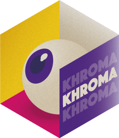
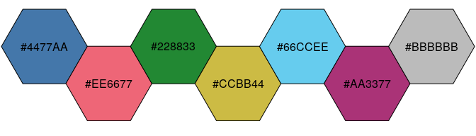
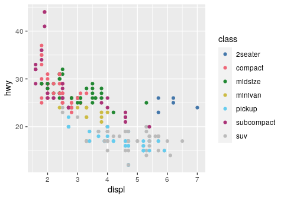
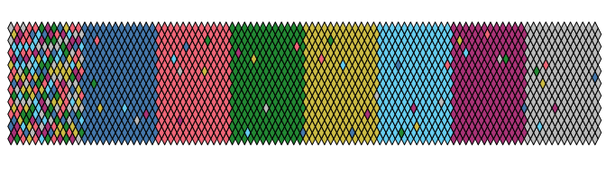
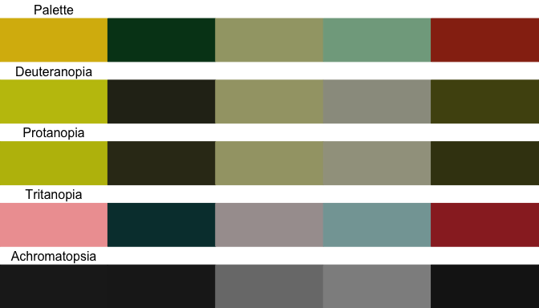

<!-- README.md is generated from README.Rmd. Please edit that file -->

# khroma 

<!-- badges: start -->

[](https://github.com/tesselle/khroma/actions)
[](https://codecov.io/gh/tesselle/khroma)

[](https://tesselle.r-universe.dev)
[](https://cran.r-project.org/package=khroma)
[](https://cran.r-project.org/web/checks/check_results_khroma.html)
[](https://cran.r-project.org/package=khroma)

[](https://www.repostatus.org/#active)

[](https://doi.org/10.5281/zenodo.1472077)
<!-- badges: end -->

## Overview

Color blindness affects a large number of individuals. When
communicating scientific results colour palettes must therefore be
carefully chosen to be accessible to all readers.

This R package provides an implementation of Okabe and Ito[1], Paul
Tol[2] and Fabio Crameri[3] colour schemes. These schemes are ready for
each type of data (qualitative, diverging or sequential), with colours
that are distinct for all people, including colour-blind readers. This
package also provides tools to simulate colour-blindness and to test how
well the colours of any palette are identifiable. To simulate
colour-blindness in production-ready R figures you may also be
interested in the
[**colorblindr**](https://github.com/clauswilke/colorblindr) package.

For specific uses, several scientific thematic schemes (geologic
timescale, land cover, FAO soils, etc.) are implemented, but these
colour schemes may not be colour-blind safe.

All these colour schemes are implemented for use with base R or
[**ggplot2**](https://github.com/tidyverse/ggplot2).

## Installation

You can install the released version of **khroma** from
[CRAN](https://CRAN.R-project.org):

``` r
install.packages("khroma")
```

And the development version from [GitHub](https://github.com/) with:

``` r
# install.packages("remotes")
remotes::install_github("tesselle/khroma")
```

## Usage

``` r
## Load packages
library(khroma)

## Install extra packages (if needed)
# install.packages(c("ggplot2", "spacesXYZ"))
```

<details>
<summary>
<strong>Available palettes</strong> (click to expand)
</summary>

``` r
## Get a table of available palettes
info()
#>             palette        type max missing
#> 1              broc   diverging 256    <NA>
#> 2              cork   diverging 256    <NA>
#> 3               vik   diverging 256    <NA>
#> 4            lisbon   diverging 256    <NA>
#> 5            tofino   diverging 256    <NA>
#> 6            berlin   diverging 256    <NA>
#> 7              roma   diverging 256    <NA>
#> 8               bam   diverging 256    <NA>
#> 9            vanimo   diverging 256    <NA>
#> 10           oleron   diverging 256    <NA>
#> 11           bukavu   diverging 256    <NA>
#> 12              fes   diverging 256    <NA>
#> 13            devon  sequential 256    <NA>
#> 14          lajolla  sequential 256    <NA>
#> 15           bamako  sequential 256    <NA>
#> 16            davos  sequential 256    <NA>
#> 17           bilbao  sequential 256    <NA>
#> 18             nuuk  sequential 256    <NA>
#> 19             oslo  sequential 256    <NA>
#> 20            grayC  sequential 256    <NA>
#> 21           hawaii  sequential 256    <NA>
#> 22            lapaz  sequential 256    <NA>
#> 23            tokyo  sequential 256    <NA>
#> 24             buda  sequential 256    <NA>
#> 25            acton  sequential 256    <NA>
#> 26            turku  sequential 256    <NA>
#> 27            imola  sequential 256    <NA>
#> 28           batlow  sequential 256    <NA>
#> 29          batlowW  sequential 256    <NA>
#> 30          batlowK  sequential 256    <NA>
#> 31            brocO  sequential 256    <NA>
#> 32            corkO  sequential 256    <NA>
#> 33             vikO  sequential 256    <NA>
#> 34            romaO  sequential 256    <NA>
#> 35             bamO  sequential 256    <NA>
#> 36           bright qualitative   7    <NA>
#> 37    high contrast qualitative   3    <NA>
#> 38          vibrant qualitative   7    <NA>
#> 39            muted qualitative   9 #DDDDDD
#> 40  medium contrast qualitative   6    <NA>
#> 41             pale qualitative   6    <NA>
#> 42             dark qualitative   6    <NA>
#> 43            light qualitative   9    <NA>
#> 44           sunset   diverging  11 #FFFFFF
#> 45             BuRd   diverging   9 #FFEE99
#> 46             PRGn   diverging   9 #FFEE99
#> 47           YlOrBr  sequential   9 #888888
#> 48       iridescent  sequential  23 #999999
#> 49 discrete rainbow  sequential  23 #777777
#> 50   smooth rainbow  sequential  34 #666666
#> 51        okabe ito qualitative   8    <NA>
#> 52     stratigraphy qualitative 175    <NA>
#> 53             soil qualitative  24    <NA>
#> 54             land qualitative  14    <NA>
```

</details>

### Colour palettes and scales

`colour()` returns a palette function that when called with a single
integer argument returns a vector of colours.

If [**crayon**](https://github.com/r-lib/crayon) is installed on your
machine and if the `crayon.enabled` option is set to `TRUE` with
`options()`, colours will be nicely printed in the console. You can
disable this feature by setting the `crayon.enabled` option to `FALSE`.

``` r
## Paul Tol's bright colour scheme
bright <- colour("bright")
bright(7)
#>      blue       red     green    yellow      cyan    purple      grey 
#> "#4477AA" "#EE6677" "#228833" "#CCBB44" "#66CCEE" "#AA3377" "#BBBBBB" 
#> attr(,"missing")
#> [1] NA
```

``` r
## Show the colour palette
plot_scheme(bright(7), colours = TRUE)
```



``` r
## Use with ggplot2
data(mpg, package = "ggplot2")

ggplot2::ggplot(data = mpg) +
  ggplot2::aes(x = displ, y = hwy, colour = class) +
  ggplot2::geom_point() +
  scale_colour_bright()
```



### Diagnostic tools

#### Test how well the colours are identifiable

``` r
## Okabe & Ito's colour scheme
okabe <- colour("okabe ito")

set.seed(12345)
plot_map(okabe(8))
```



#### Compute CIELAB distance metric

``` r
DeltaE <- compare(okabe(8))
round(DeltaE, 2)
#>                black orange sky blue bluish green yellow  blue vermilion
#> orange         64.74                                                    
#> sky blue       60.95  53.61                                             
#> bluish green   50.51  42.87    34.69                                    
#> yellow         88.42  21.72    57.53        38.04                       
#> blue           39.23  55.35    22.31        38.40  70.37                
#> vermilion      49.36  22.24    52.27        54.36  43.71 49.62          
#> reddish purple 53.11  49.01    45.51        63.45  62.54 41.11     37.02
```

#### Simulate colour-blindness

``` r
plot_scheme_colourblind(okabe(8))
```


``` r
## ggplot2 default colour scheme
## (equally spaced hues around the colour wheel)
x <- scales::hue_pal()(8)
plot_scheme_colourblind(x)
```



## Colour Schemes

### Colour Schemes

Paul Tol and Fabio Crameri offer carefully chosen schemes, ready for
each type of data, with colours that are:

-   Distinct for all people, including colour-blind readers,
-   Distinct from black and white,
-   Distinct on screen and paper,
-   Matching well together,
-   Citable & reproducible.

See `vignette("tol")` and `vignette("crameri")` for a more complete
overview.

### Scientific colour schemes

The following scientific colour schemes are available:

-   International Chronostratigraphic Chart;
-   AVHRR Global Land Cover Classification;
-   FAO Soil Reference Groups.

More will be added in future releases ([suggestions are
welcome](https://github.com/tesselle/khroma/issues)).

## Contributing

Please note that the **khroma** project is released with a [Contributor
Code of Conduct](https://www.tesselle.org/conduct.html). By contributing
to this project, you agree to abide by its terms.

## References

[1] Okabe, M. & Ito, K. (2008). *Color Universal Design (CUD): How to
Make Figures and Presentations That Are Friendly to Colorblind People*.
URL: <https://jfly.uni-koeln.de/color/>.

[2] Tol, P. (2021). *Colour Schemes*. SRON. Technical Note
No. SRON/EPS/TN/09-002. URL:
<https://personal.sron.nl/~pault/data/colourschemes.pdf>.

[3] Crameri, F. (2018). Geodynamic diagnostics, scientific visualisation
and StagLab 3.0. *Geosci. Model Dev.*, 11, 2541-2562.
<https://doi.org/10.5194/gmd-11-2541-2018>
