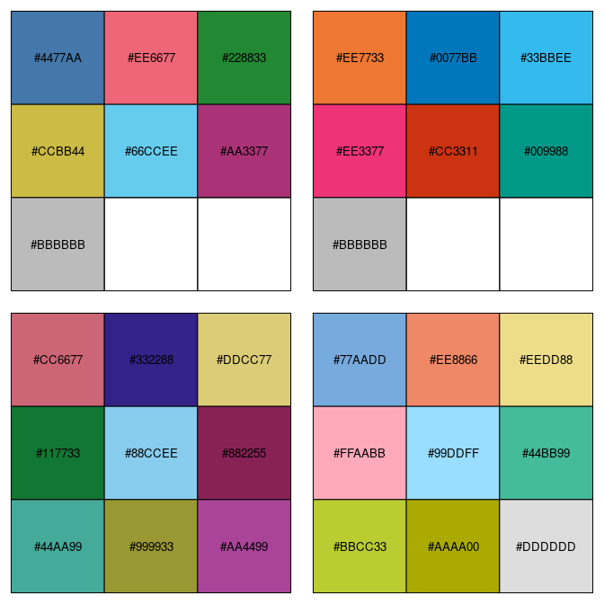
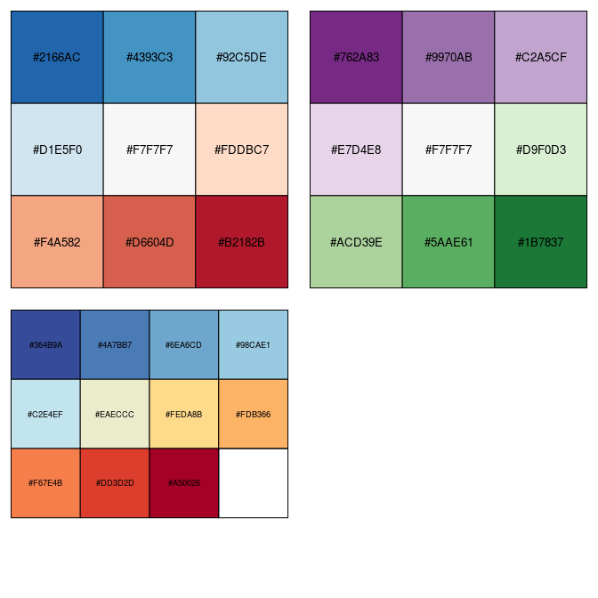
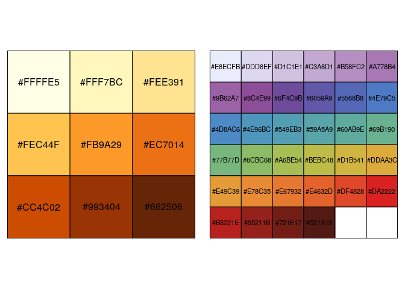

<!-- README.md is generated from README.Rmd. Please edit that file -->
khroma
======

[](https://travis-ci.org/nfrerebeau/khroma) [](https://cran.r-project.org/package=khroma) [](https://www.tidyverse.org/lifecycle/#maturing) [](https://zenodo.org/badge/latestdoi/152768624)

Overview
--------

`khroma` is a utility package: it provides usefull colour schemes for archaeological data visualization. `khroma` provides Paul Tol's colour schemes and several thematic palettes (geologic timescale, etc.) with scales for `ggplot2`.

Installation
------------

Install the released version of khroma from CRAN:

``` r
install.packages("khroma")
```

Or install the development version from GitHub with:

``` r
# install.packages("devtools")
devtools::install_github("nfrerebeau/khroma")
```

Usage
-----

### Paul Tol's Colour Schemes

Paul Tol offers carefully chosen schemes, ready for each type of data, with colours that are:

-   distinct for all people, including colour-blind readers;
-   distinct from black and white;
-   distinct on screen and paper;
-   matching well together.

All the scales presented in his 2018 technical [1] note are implemented here, for use with `graphics` or `ggplot2`.

#### Qualitative data



#### Diverging data



#### Sequential data



### Scientific colour schemes

For now, the only scientific colour scheme available is that of the International Chronostratigraphic Chart. More will be added in future releases (suggestions are welcome).

[1] Tol, Paul (2018). *Colour Schemes*. SRON. Technical Note No. SRON/EPS/TN/09-002. URL: <https://personal.sron.nl/~pault/data/colourschemes.pdf>.
